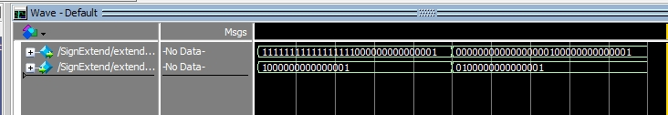

# Seminario de Solución de Arquitectura de Computadoras
**Proyecto Final - Arquitectura MIPS**
**Equipo #1**

**Thorns-H** - *Abraham Magaña Hernández*

**NexusAOD** - *Samuel Espinoza Sucilla*

**G4GA** - *Damian Guevara*

## Screenshots Fase #1 :
#### Module "PC.v"

#### Module "SignExtend.v"

#### Module "ShiftLeft.v"

#### Module "Mux2_1_5.v"

