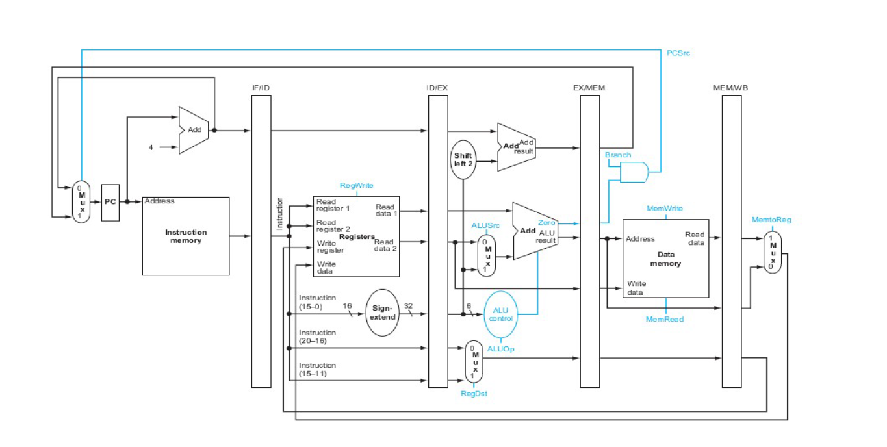

# 💬 Seminario de Solución de Arquitectura de Computadoras
**ⓘ Acerca de este repositorio:**  

Este repositorio es para guardar los archivos y el seguimiento de nuestro proyecto final del seminario de arquitectura de computadoras en segundo semestre de [Ingeniería en Computación](http://www.cucei.udg.mx/es/oferta-academica/licenciaturas/licenciatura-en-ingenieria-en-computacion) en el [Centro Universitario de Ciencias Exactas e Ingenierías](http://www.cucei.udg.mx/es).

**ⓘ Este proyecto fue realizado en equipo, nuestros miembros son:** 

>[*Abraham Magaña Hernández*](https://github.com/Thorns-H)

>[*Samuel Espinoza Sucilla*](https://github.com/NexusAOD)

>[*Damian Guevara*](https://github.com/G4GA)

Apartando esto, en este repositorio también hay un decoder programado en [Python](https://www.python.org/) que pueden usar libremente para crear sus propias instrucciones del mips, así como también un bot de discord para comprobar las instrucciones más fácilmente.

**ⓘ Aclaraciones:**

Este proyecto fue escrito completamente en Windows usando [ModelSim](https://www.intel.la/content/www/xl/es/software/programmable/quartus-prime/model-sim.html) para compilar y visualizar los datos en la memoria. Es posible y esta comprobado que esto no funciona y puede causar problemas al momento de compilar usando [Icarus Verilog](http://iverilog.icarus.com/) y [GTKWave](http://gtkwave.sourceforge.net/) para visualizar el funcionamiento.

En caso de estar en Linux, hagan uso del *$dumpfile y $dumpvars*, con ello no debe haber ningún problema para ejecutar la simulación.

Muchas gracias al [Prof. Jorge Ernesto López Arce](http://www.cucei.udg.mx/maestrias/electronica/es/contenido/jorge-ernesto-lopez-arce-delgado) por impartir esta materia, dios sabe que di una buena reseña de usted en el ahora caido WikiProfes.

## Arquitectura MIPS

